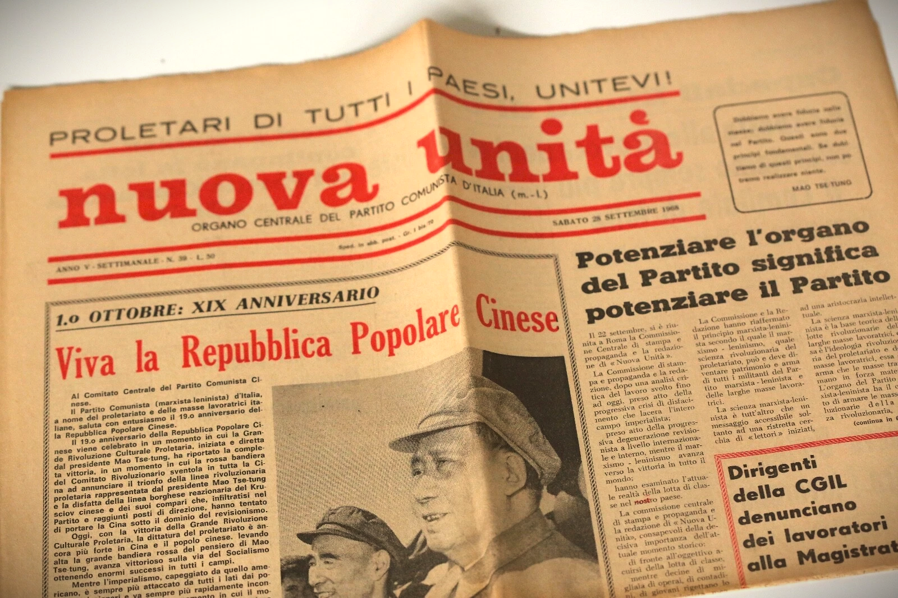

---
hide:
  - toc
---

# Archivio del Maoismo Italiano

L'**AMI** è un archivio digitale dedicato alla documentazione storica sul maoismo italiano. Questo sito funge da catalogo scientifico: ogni scheda descrive un documento conservato su **Internet Archive**.

    

---

## 📥 Aggiunti di recente

    
📘 1968

    

        
<a href="documenti/AMI-0031/">Sulla tattica contro l'imperialismo giapponese</a>

        
Opuscolo · Casa editrice in lingue estere

        
Partito comunista cinese; Maoismo; Guerra civile cinese; Lunga marcia

    

    
📘 1968

    

        
<a href="documenti/AMI-0030/">La bussola che guida i popoli rivoluzionari di tutti i paesi verso la vittoria</a>

        
Opuscolo · Casa editrice in lingue estere

        
Partito comunista cinese; Maoismo; Rivoluzione culturale

    

    
📰 1 dicembre 1968

    

        
<a href="documenti/AMI-0029/">Lavoro Politico no. 11/12</a>

        
Periodico · Centro di Informazione di Verona

        
Partito Comunista d'Italia (marxista-leninista); Partito Comunista d'Italia (marxista-leninista) - linea rossa; Lavoro Politico; Maoismo; Marxismo-leninismo

    

    <a href="documenti/" class="md-button md-button--primary">📂 Tutti i documenti</a>

